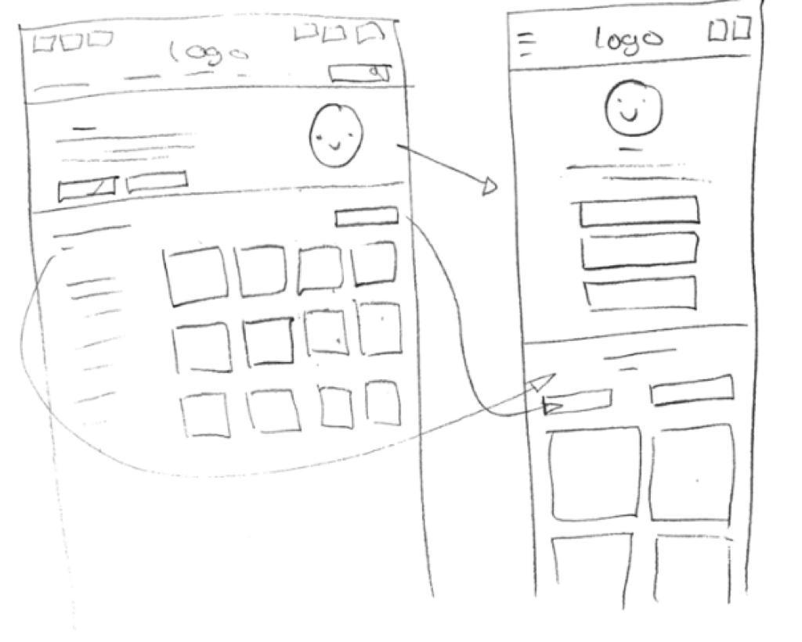

# Procesverslag
Markdown is een simpele manier om HTML te schrijven.  
Markdown cheat cheet: [Hulp bij het schrijven van Markdown](https://github.com/adam-p/markdown-here/wiki/Markdown-Cheatsheet).

Nb. De standaardstructuur en de spartaanse opmaak van de README.md zijn helemaal prima. Het gaat om de inhoud van je procesverslag. Besteedt de tijd voor pracht en praal aan je website.

Nb. Door *open* toe te voegen aan een *details* element kun je deze standaard open zetten. Fijn om dat steeds voor de relevante stuk(ken) te doen.

## Jij

  
uitwerken voor kick-off werkgroep

  ### Auteur:
  Sanne 't Hooft (vervangen door jouw naam)

  #### Je startniveau:
  hier je startniveau (kies uit zwart, rood óf blauw)

  #### Je focus:
  hier je focus (kies uit responsive óf surface plane)
 

## Je website

  
uitwerken voor kick-off werkgroep

  ### Je opdracht:
  Sanrio.com

  #### Screenshot(s) van de eerste pagina (small screen): 
  Home  
  

  #### Screenshot(s) van de tweede pagina (small screen):
  Kuromi
  
 

## Toegankelijkheidstest 1/2 (week 1)

  
uitwerken na test in 1e werkgroep

  ### Bevindingen
  Lijst met je bevindingen die in de test naar voren kwamen:

  #### Screenreader
  Hier korte omschrijving (met indien nodig afbeeldingen)

  Hier een omschrijving van hoe het opgelost kan worden (met indien nodig afbeeldingen)

  #### Muis en Toetsenbord 
  Hier korte omschrijving (met indien nodig afbeeldingen)

  Hier een omschrijving van hoe het opgelost kan worden (met indien nodig afbeeldingen)

  #### Motoriek (shocks, elastiekjes)
  Hier korte omschrijving (met indien nodig afbeeldingen)

  Hier een omschrijving van hoe het opgelost kan worden (met indien nodig afbeeldingen)

  #### Visueel (brillen, contrast, kleurenblind, dark/light). 
  Hier korte omschrijving (met indien nodig afbeeldingen)

  Hier een omschrijving van hoe het opgelost kan worden (met indien nodig afbeeldingen)

## Breakdownschets (week 1)

  
uitwerken na afloop 2e werkgroep

  Tijdens de les heb ik gevonden dat bovenaan de site de zwarte tekst op het blauwe vlak minder goed te lezen is. De dunne tekst is ook iets moeilijk te lezen. De voice Over is niet heel erg tof, maar ook niet slecht. Met mijn vingers vastgebonden was de site prima door te gaan sinds de knoppen allemaal aardig groot waren. Met de apparaten op de armen was de site moeilijk door te gaan.

  ### de hele pagina: 
  
  

## Voortgang 1 (week 2)

  
uitwerken voor 1e voortgang

  ### Stand van zaken
Ik heb heel erg moeten denken over hoe ik de karakters goed moet krijgen dat als je het scherm breder maakt ze allemaal naast elkaar moeten komen. Voor de rest ging Alles prima. Ik ben gewoon de html op gaan stellen en tot nu toe ben ik bijna klaar met alles erin zetten en heb ik al de fonts getest, en ze werkten! De site begint al goed te lijken en de plaatjes hebben nu ook allemaal de juiste grootte

  ### Verslag van meeting
  Ik heb hulp gekregen met sommige onderdelen neit niet helemaal lekker wilden meeschalen. Van Robert hoefde ik niet de body 80% width te geven omdat hij dan niet lekker meer werkt, dus dat ga ik niet meer doen. Na veel hulp staat ook eindelijk de tekst op het beginplaatje op de juiste plek. 

## Voortgang 2 (week 3)

  
uitwerken voor 2e voortgang

  ### Stand van zaken
Ik ben deze week de mobile first van pagina een gaan opmaken met css. Tot nu toe lukt het allemaal. Alleen soms wrapt hij niet helemaal goed. Wel heb ik de juiste html elemanten al kunnen laten verdwijnen op de mobile versie door ze een display: none; te geven. De mobile first is nu bijna helemaal af!

  ### Meeting
  Met de student assistent heb ik naar mijn site gekeken en wat dingetjes verbeterd. Samen hebben we gekeken naar het "sweet happy news" deel gekeken wat nog niet helemaal er goed uitzag, maar door er samen naar te kijken hebben we het zeker verbeterd.
- ...

## Toegankelijkheidstest 2/2 (week 4)

  
uitwerken na test in 8e werkgroep

  ### Bevindingen
  Lijst met je bevindingen die in de test naar voren kwamen (geef ook aan wat er verbeterd is):

  #### Screenreader
  Heel veel dingen worden niet voorgelezen of opgemerkt door de tab functie, omdat ik er bijvoorbeeld geen linkje van heb gemaakt en het alleen een 
  afbeelding is.
  Heel veel afbeeldingen heb ik ook geen alt gegeven.
  Heel makkelijk is om alle afbeeldingen een alt te geven zodat deze voorgelezen kunnen worden. Ook een paar dingen een linkje maken.
  De webshop is niet gebruiksvriendelijk. Je weet totaal niet op welk product je je bevind.

  #### Muis en Toetsenbord 
  Met tab kom je overal wel en met muis ook gemakkelijk.

  #### Motoriek (shocks, elastiekjes)
  Ook met shocks kon ik prima nog door mijn site scrollen en naar de knoppen navigeren. Alleen de "read me" knopjes waren wat klein en kunnen misschien groter.

  #### Visueel (brillen, contrast, kleurenblind, dark/light). 
  Met alle vormen van kleurenblindheid is mijn site nog zeer makkelijk te lezen en alles te onderscheiden.
  Alleen voor slechte/geblurde vision is mijn dunne lettertype wat moeilijk te lezen en deze zou eventueel ietsje groter morgen.
  
  
  Hier een omschrijving van hoe het opgelost kan worden (met indien nodig afbeeldingen)

## Voortgang 3 (week 4)

  
uitwerken voor 3e voortgang

  ### Stand van zaken
Alles ging prima en heb ik met hulp de wenshop goed gekregen en nu staat alles goed op zijn plek. Ik ben bijna klaar met alles en moet alleen meer gebruik maken van roots en nth-of-type.

  ### Verslag van meeting
  hier na afloop snel de uitkomsten van de meeting vastleggen

  - Een article gezet in pagina twee zodat dingen nu op hun plaats blijven
  - Feedback gekrregen op mijn website zelf, wat ook goed was

## Eindgesprek (week 5)

  

  Ik heb een animatie toegevoegd op een plek die mij ervoor leuk leek op pagina een, bij de karakters.Voor de rest heb ik hier en daar nog wat aangepast zodat het er beter uitzag.
  Ook heb ik de webshop gebruiksvriendelijker gemaakt voor slechtzienden, door een aria-label toe te voegen aan de knoppen van de eerste drie producten
als voorbeeld. Hierdoor weten ze op welk product ze zich bevinden. Ik heb ook de read me knoppen groter gemaakt.
  De p heb ik ook ietsje groter gemaakt voor betere zichtbaarheid.
  

  ### Je uitkomst - karakteristiek screenshots:
  

  ### Dit ging goed/Heb ik geleerd: 
  Korte omschrijving met plaatjes

  

  ### Dit was lastig/Is niet gelukt:
  
  Ik heb de slider voor de just for you sectie niet gemaakt. Ik heb er even mee lopen struggelen en heb besloten dat het niet de moeite waard was.
  
  Ook heeft mijn site 3 media-queries waarin het navigatiemenu verschuift en responsive wordt. Ik heb het bij twee gelaten, omdat ik niet snapte hoe ik precies 3 moest doen en ik het beter vond om het er met 2 beter uit moet laten zien, in plaats van slecht met 3.

## Bronnenlijst

  
continu bijhouden terwijl je werkt

  Nb. Wees specifiek ('css-tricks' als bron is bijv. niet specifiek genoeg).

  1. https://www.youtube.com/watch?v=OQZNAMjC6Vg&ab_channel=Devression
  2. https://www.w3schools.com/howto/howto_css_round_buttons.asp
  3. Kevin

